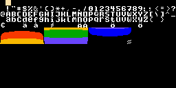
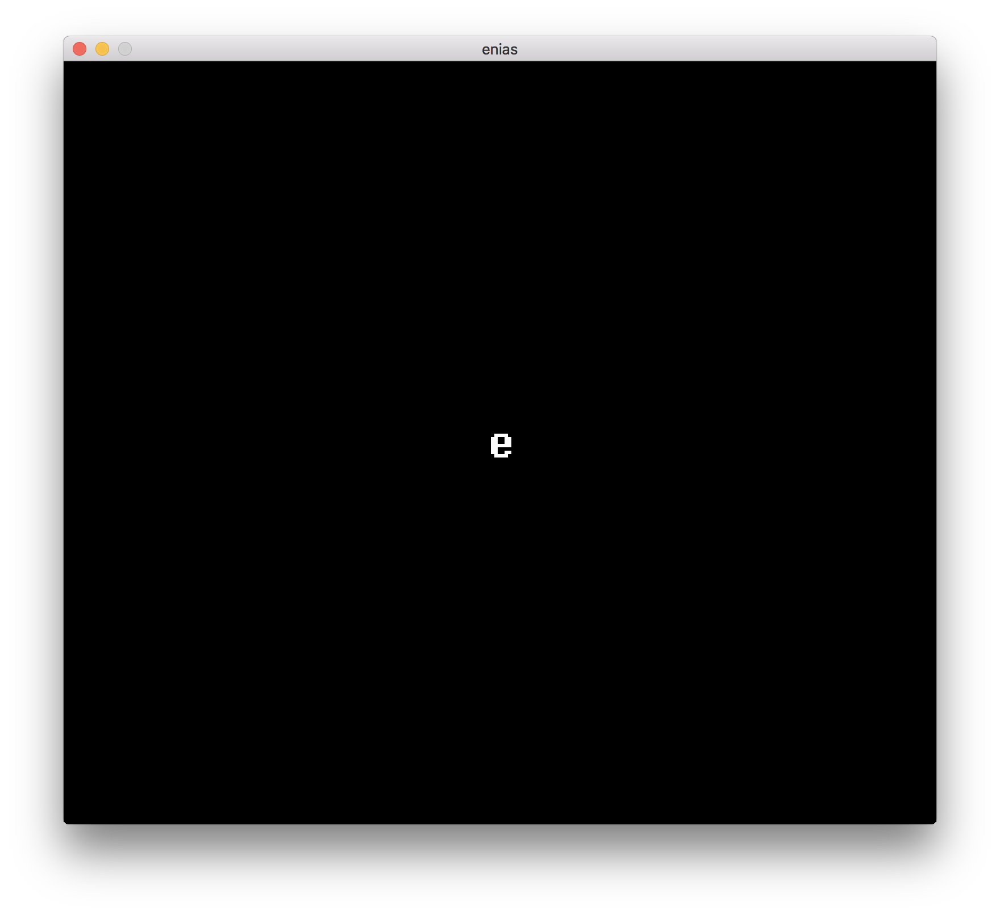

# The Enias Tutorial

## Lesson 0 - installing Enias
1. Install the `ca65` compiler, either through `brew install cc65` or manually:
   1. Clone [https://github.com/cc65/cc65](https://github.com/cc65/cc65)
   2. `cd` into the directory and run `make`
   3. Finally, to make the binaries available on your system, run `sudo make avail`
2. Install SDL2 via brew or from source (https://www.libsdl.org/download-2.0.php).
3. Clone this repo.
4. Go to `<path-to-enias>/src/` and run `$ ./compile`

## Lesson 1 - a minimal project
1. Create an empty project directory
2. Add a file called `lesson1.s` and enter the following 6502 assembler:

```6502
    .org $0200

    rts
```

3. Compile to an object file with

```bash
$ ca65 lesson1.s
```

4. Then link it (using the Enias memory [layout config file](../asm/enias.cfg))

```bash
$ ld65 -C <path-to-enias>/asm/enias.cfg lesson1.o
```

5. This will produce a `a.out` executable:

```bash
$ ls
a.out
lesson1.s
lesson1.o
```

6. Finally - run it inside enias

```bash
$ <path-to-enias>/src/enias a.out
```

7. For your convenience we've added a `compile.sh` script that does all of the above steps in one go, so you can just do

```bash
$ ./compile.sh
```

## Lesson 2 - rendering a sprite

1. Enias only support 16 colors at the same time. To define those colors, a palette file is used. An example palette can be found in [/assets/palette.bin](assets/palette.bin). It contains 16 RGB colors of 24-bits each.

2. Sprites and symbols (font characters, map tiles, etc.) all share the same pixel definition. It can be found in the file [/assets/tiles.bin](assets/tiles.bin)

3. The `.segment` tells the `ld65` linker where a certain resource is stored in memory. Adding the following statements will let Enias find the pixel data and the palette.

```6502
    .org $0200

    rts

    .segment "GFX_TILES"
        .incbin "../assets/tiles.bin"

    .segment "GFX_PALETTE"
    .incbin "../assets/palette.bin"
```

4. Enias supports 64 sprites of 8x8 pixels each. To actually render a sprite we have to define its position (X and Y) plus its tile index (its position in GFX_TILES).



For example, to render the letter 'e' in the middle of the screen we have to set one of the sprites' X to 124, Y to 108, and tile to 101. It doesn't really matter which one of the sprites we use (0 - 63) unless we care about the order of rendering (higher sprite indexes are rendered on top).

5. To make it easier to refer to the "array" of sprites we define a constant:

```6502
ENIAS_SPRITES = $F400
```

This magical value is the memory location (in hex) where Enias knows to look for the sprites.

6. With the help of this constant and the registers `x` (usually used for offsets) and `a` (usually used for doing math) we can set the X position of sprite nr 0 (C-style code on the right):

```6502
    ldx #00                 ; x = 0
    lda #124                ; a = 124
    sta ENIAS_SPRITES,x     ; ENIAS_SPRITES[x] = a
```

7. By changing the offset we can set the Y and the tile index too:

```6502
    inx                         ; x++
    lda #108                    ; a = 108
    sta ENIAS_SPRITES,x         ; ENIAS_SPRITES[x] = a

    inx                         ; x++
    lda #101                    ; a = 101
    sta ENIAS_SPRITES,x         ; ENIAS_SPRITES[x] = a
```

8. Remember to not remove the call to `rts` at the end, it passes execution back to Enias. Without it your program will crash!

9. Try building and running the code with the same commands as in lesson 1. If it fails, check out the [example source code](lesson2/lesson2.s). If all goes well you should see the following window:



## Lesson 3 - moving a sprite

1. A static sprite is no fun - lets make it move! To do this we need a variable. Copy the code from lesson 2 and then add this before the other segment definitions:

```6502
sprite_x:
    .byte $00
```

The linker (ld65) will find a good memory location for this variable that now has the name "sprite_x". The `.byte` reserves 1 byte in memory.

2. Instead of setting the sprite X position to a compile time constant we can now use this fancy (global) variable instead:

```6502
    ldx #00
    lda sprite_x                ; a = sprite_x
    sta ENIAS_SPRITES,x
```

3. But hold your horses, this will not be a very fun demo. We need to change `sprite_x` for the sprite to start moving. Let's increase it by one each frame:

```6502
    ldx sprite_x       ; x = sprite_x
    inx                ; x++
    stx sprite_x       ; sprite_x = x
```

This pattern is so common that there is a shortcut though:

```6502
    inc sprite_x
```

## Lesson 4 - interactivity

1. Enias supports both computer keyboards and USB gamepads. To get input we can read the memory from `$FB00` and use a bitmask to know if a certain key/button is pressed. In this example we will expand the lesson 3 demo with the ability to move up or down ($04 and $08 respectively). First, define a constant for the input memory location:

```6502
ENIAS_GAMEPAD = $FB00
```

2. Below the code for moving the sprite (but before `rts`!) we can read the value of the gamepad into register `a`:

```6502
lda ENIAS_GAMEPAD
```

3. To enable vertical movement another global variable must be added:

```6502
sprite_y:
    .byte 108
```

Make sure it is used in the code above too:

```6502
;; Set Y
    inx
    lda sprite_y
    sta ENIAS_SPRITES,x
```

4. To handle the input, compare the bits in register `a` with the bits in the constant for the up button ($04, or `00000100` in binary) using `and`. If the result contains was only zeroes (checked with the `beq` command) we jump over the code that modifies `sprite_y`.

```6502
    lda ENIAS_GAMEPAD     ; a = ENIAS_GAMEPAD
    and #$04              ; result = a & 0x04
    beq dont_move         ; if(result == 0) { goto dont_move }
    inc sprite_y          ; sprite_y++
dont_move:
```

Now the 'e' can be moved with the `down` key.

5. To handle going up also, the code needs a little extension. We also rename "dont_move" to "dont_move_down" to make it a bit more clear.

```6502
    lda ENIAS_GAMEPAD
    and #$04
    beq dont_move_down
    inc sprite_y
dont_move_down:
    lda ENIAS_GAMEPAD
    and #$08
    beq dont_move_up
    dec sprite_y
dont_move_up:
```
